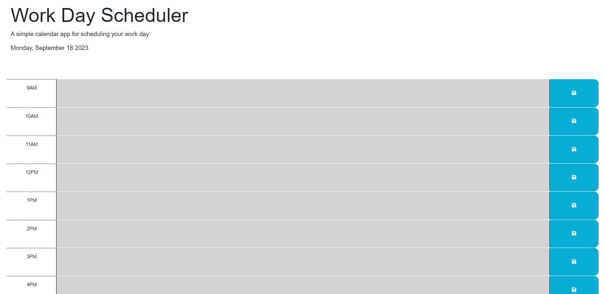

# Project Title

This project is a Daily schedule tracker. the user will input their schedule into this tracker and it will save their notes into the local storage and the information will persist even when the browser is closed. the user will be able to log future and past tense tasks into the tracker and the tracker will update via color coordination to inform the user when these tasks are completed or when the upcoming tasks are need to be completed. this tracker

## Table of Contents

- [Features](#features)
- [Usage](#usage)

## Features

- this site features color coordination to times throughout the day and the site features a live date below the title that changes as the days go. 

## Usage

the intendeded use for this site is to help the user organize their daily tasks throughout their work day or daily life tasks. 

